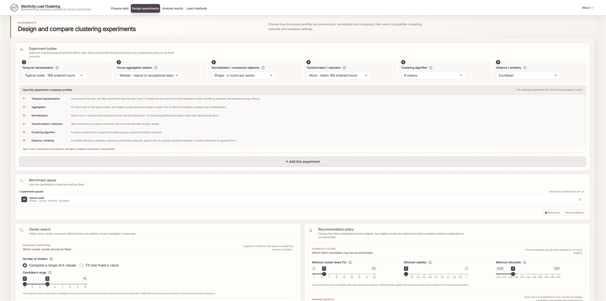
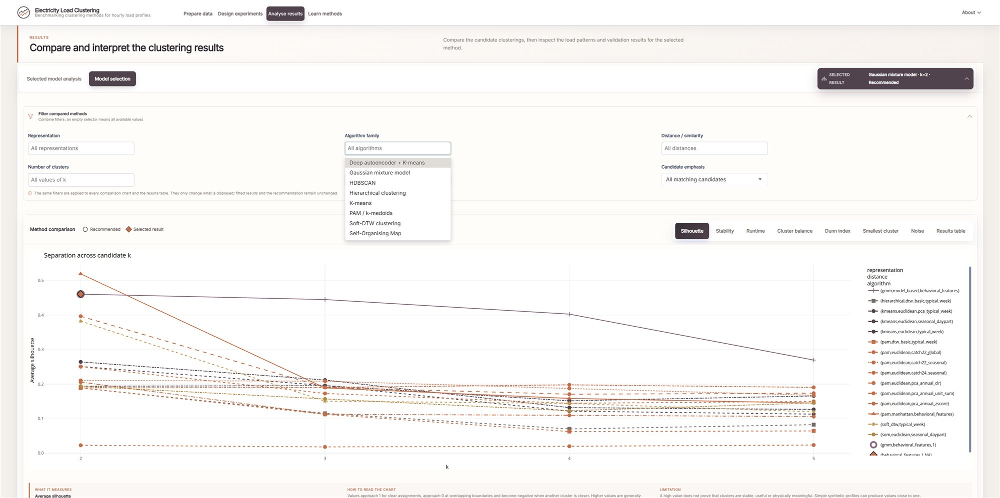
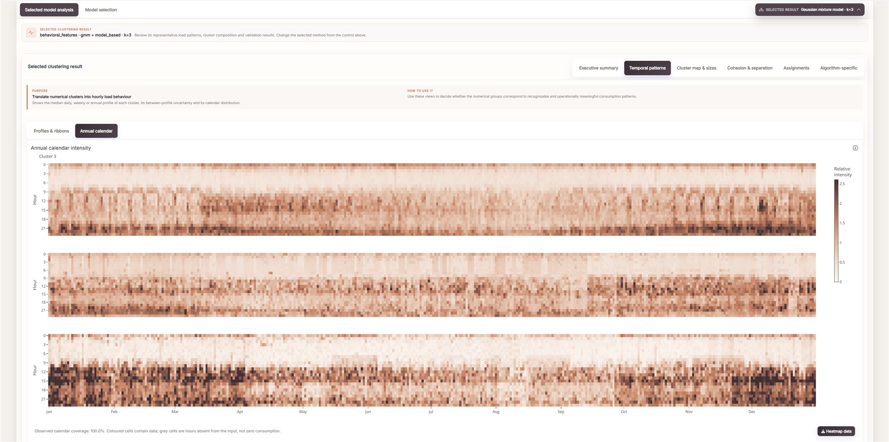
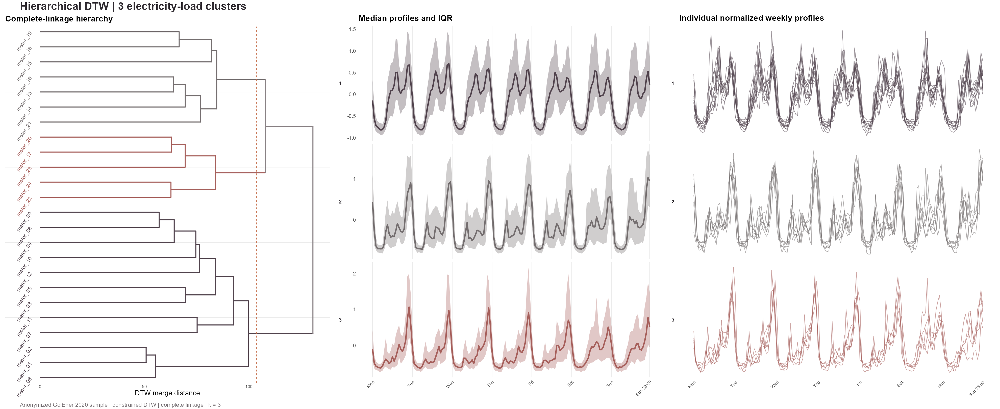

# electricity-load-timeseries-clustering

An R project for comparing ways to cluster hourly electricity load profiles.
The pipeline checks and regularizes complete annual smart-meter series, builds
several representations of the same data, and compares compatible combinations
of normalization, distance and clustering method. The output includes cluster
profiles, assignments and validation diagnostics so that the resulting groups
can be inspected rather than accepted on the basis of a single score.

**Live application:** [Open the deployed Shiny app](https://enriquefuster-electricity-load-timeseries-clustering.share.connect.posit.cloud/)

## Methodology

Reasonable modelling choices can produce noticeably different partitions from
the same set of meters. For that reason, representation, normalization, distance,
clustering and validation are treated as separate steps. A benchmark can then
change one decision at a time and show which part of the pipeline is responsible
for the difference.

The same preprocessing and quality rules are used by the RStudio workflow, the
CLI and the Shiny app. Model comparison is also kept separate from the inspection
of a chosen result. Switching between fitted candidates in the app therefore
changes what is displayed, but does not rerun the benchmark or alter the scores
that were used for comparison.

The [`clustering theory guide`](docs/clustering_theory_guide.md) contains the
background needed to follow the benchmark. It covers the unit of analysis,
representations, normalization, distances, clustering methods, validation and
interpretation, and records the assumptions and limitations of the implementation.
The same material is available in shorter form under **Learn** in the Shiny app.
The information icon beside each control is reserved for the immediate effect of
that setting.

Quesada et al. (2025) was an important reference when designing the benchmark,
especially its use of seasonal features, Self-Organising Maps and expert
validation to obtain interpretable electricity-consumption typologies. This
repository does not reproduce that pipeline. It uses a wider set of
representations and clustering methods so that those choices can be compared
under the same data-quality and validation rules. See the
[paper](https://doi.org/10.1016/j.egyr.2025.09.002) and the theory guide for a
more detailed comparison.

> Quesada, C., Montero-Manso, P., Pflugradt, N., Astigarraga, L., Merveille,
> C., Casado-Mansilla, D. and Borges, C. E. (2025). “A data-driven methodology
> for deriving electricity consumption typologies from smart meters.” *Energy
> Reports*, 14, 2420–2434. https://doi.org/10.1016/j.egyr.2025.09.002

## Application preview

The deployed app covers experiment design, benchmark comparison and detailed
inspection of the selected clustering result.







Open the [live application](https://enriquefuster-electricity-load-timeseries-clustering.share.connect.posit.cloud/)
to explore the complete interactive views.



This is one fitted example from the benchmark: the bundled anonymized GoiEner
2020 sample using
`typical_week + dtw_hclust` with `k = 3`. This three-cluster cut is shown because
it makes the hierarchy and its profile families easy to inspect; it is not the
best-scoring cut under the configured validation rules. The benchmark also contains flat,
probabilistic, density-based, shape-based and representation-learning methods;
their outputs and diagnostics differ from this hierarchical view. The centre
panel shows the median normalized week and its Q25–Q75 interval calculated from
the source observations across weeks and cluster members. The right panel shows
the normalized weekly profiles used as inputs to this clustering, on a common
vertical scale. Regenerate
the figure with `Rscript scripts/build_readme_dendrogram_figure.R` after rebuilding
the Shiny benchmark.

## Start here

Open `electricity-load-timeseries-clustering.Rproj` in RStudio and restore the
recorded package environment once:

```r
renv::restore()
```

The autoencoder experiment needs the Torch CPU runtime, which is installed
separately:

```r
torch::install_torch()
```

The rest of the benchmark does not depend on Torch. If the runtime is missing,
the autoencoder candidate is recorded as a failed fit and the remaining methods
continue normally.

There are three ways to run the project. All of them call the same functions in
`R/`:

| Entry point | Use it when | Command from the project root |
|---|---|---|
| `main.R` | You want to follow the complete calculation in RStudio, inspect objects, see plots, and save a documented run. | `source("main.R")` |
| `cli/cluster_load_profiles.R` | You want a repeatable batch run from a terminal, scheduler, or another process. | `Rscript cli/cluster_load_profiles.R --help` |
| `app/app.R` | You want an interactive experiment with demo data or uploaded curves. | `shiny::runApp("app")` |

Terminal examples below assume that the current directory is the repository
root and that `Rscript` is on the system `PATH`. If it is not, call the
executable from its actual location in the local R installation.

```mermaid
flowchart LR
  A[Hourly CSV input] --> B[Schema and quality gate]
  B --> C[Align every profile to an hourly calendar]
  C --> D[Fill only permitted gaps]
  D --> E[Retain annual, weekly, seasonal or behavioural information]
  E --> F[Choose whether comparison emphasizes magnitude or shape]
  F --> G[Fit compatible distance and clustering combinations]
  G --> H[Silhouette / stability / Dunn / balance / runtime]
  H --> I[Recommended model]
  I --> J[Assignments / profile bands / atypicality]
  J --> K[Plots + CSV/JSON/RDS]
  K --> L[Shiny and saved outputs]
```



## 1. Run from RStudio

`main.R` is the easiest entry point when working interactively in RStudio. It
contains the run parameters and calls five stage scripts in order. The actual
calculations live in `R/`, which keeps the top-level workflow short enough to
read from start to finish.

```r
source("main.R")
```

The stages are:

1. `scripts/main_run_preload.R`: load project functions and YAML configuration.
2. `scripts/main_run_input.R`: read and canonicalize the input curves.
3. `scripts/main_run_models.R`: run quality checks, preprocessing, clustering,
   comparison, and model selection.
4. `scripts/main_review_results.R`: print conclusions and build the plots.
5. `scripts/main_save_results.R`: write tables, models, conclusions, and plots.

The main analysis objects remain available in the R session after the run:

```r
View(analysis$quality)
View(analysis$typical_week)
View(analysis$metrics)
View(analysis$assignments)
analysis$recommended
analysis$benchmark_models
analysis$plots$prototypes
analysis$plots$pca
```

By default, `main.R` uses the bundled demo. To analyse a long-format CSV,
change the parameters at the top of the file:

```r
# main.R — run parameters
config_file = "config/default.yml"
input_mode = "long"
input_path = "data/raw/my_curves.csv"
output_path = "results/main/my_run"
```

Save the file and run `source("main.R")`.

For a folder containing one CSV per series:

```r
# main.R — run parameters
config_file = "config/default.yml"
input_mode = "folder"
input_path = "data/raw/my_curve_folder"
output_path = "results/main/folder_run"
```

## 2. Configuration

Model and preprocessing settings are stored in YAML rather than being scattered
through the UI or model functions. Use `config/demo.yml` for the bundled demo
and `config/default.yml` as the starting point for external data.

```yaml
input:
  pattern: "\\.csv$"
  timestamp_column: timestamp
  value_column: kWh
  series_id_column: null
  delimiter: ","
  timezone: UTC

quality:
  max_missing_pct: 10
  require_complete_natural_year: true
  complete_year_max_missing_pct: 2
  warning_missing_pct: 2
  min_coverage_days: 365
  negative_values: exclude

preprocessing:
  aggregation: median
  normalization: zscore
  imputation: linear

privacy:
  anonymize_series_ids: false
  id_prefix: profile

modeling:
  experiments:
    - {representation: typical_week, recipe: pam_dtw}
    - {representation: typical_week, recipe: dtw_hclust}
    - {representation: seasonal_daypart, recipe: som_euclidean}
    - {representation: behavioral_features, recipe: gmm_model}
  k_mode: auto
  fixed_k: 3
  k_min: 2
  k_max: 6
  repeats: 5
  seed: 4107
  dtw_window_size: 12
  min_cluster_share: 0.05
  min_stability: 0.0
  min_silhouette: 0.0
  max_noise_share: 0.20
  advanced:
    hdbscan_min_points: 3
    soft_dtw_gamma: 0.05
    som_iterations: 100
    deep_latent_dimensions: 4
    deep_epochs: 80
```

### Parameter reference

| Parameter | Meaning | Practical effect |
|---|---|---|
| `aggregation` | `median` or `mean` within each hour-of-week bin. | Median resists spikes; mean retains their influence. |
| `normalization` | `zscore`, `unit_sum`, or `none`. | Z-score prioritizes shape; none includes consumption magnitude. |
| `pca_explained_variance` | Cumulative variance target in `(0, 1]`. | Defaults to 0.95 for every PCA representation. |
| `pca_max_components` | Maximum retained PCA dimensions. | Defaults to 30; the variance target can be truncated by this cap. |
| `clr_zero_replacement_fraction` | Fraction of the smallest positive hourly share. | Defaults to 0.5 and is used only before CLR. |
| `max_missing_pct` | Exclusion threshold before imputation. | Excludes curves with too much missing data before imputation. |
| `require_complete_natural_year` | Require at least one January–December hourly window. | Requires a complete January–December window for seasonal summaries. |
| `complete_year_max_missing_pct` | Missing-hour allowance inside the selected natural year. | Defaults to 2%; the accepted year is then regularized and imputed. |
| `min_coverage_days` | Minimum temporal span. | Defaults to 365 days in the complete-year study. |
| `anonymize_series_ids` | Replace source IDs before any analysis or output. | Optional; disabled by default. |
| `id_prefix` | Prefix for generated IDs such as `profile_001`. | Controls the names assigned to anonymized profiles. |
| `experiments` | Explicit representation and compatible method combinations. | Lists the representation/method combinations that will actually be fitted. |
| `k_mode` | `auto` or `manual`. | Auto evaluates `k_min:k_max`; manual evaluates only `fixed_k`. |
| `repeats` | Repeated 80% meter subsamples. | More repeats give a less noisy stability estimate and take longer to run. |
| `dtw_window_size` | Maximum DTW temporal displacement in hours. | Limits how far DTW may shift events in time. |
| `seed` | Reproducible random seed. | Fixes the random state used by stochastic steps. |
| `min_cluster_share` | Minimum share required in every non-noise cluster. | Defaults to 5%; candidates below it remain inspectable but cannot be recommended. |
| `min_stability`, `min_silhouette` | Minimum validation scores for recommendation. | Defaults to 0 for both and can be tightened by the user. |
| `max_noise_share` | Maximum HDBSCAN noise fraction. | Defaults to 20%. |
| `advanced.*` | Method-specific HDBSCAN, Soft-DTW, SOM and autoencoder controls. | Method-specific settings shared by the YAML configuration and the app. |

The automatic ranking combines normalized silhouette (55%), adjusted Rand
stability from repeated 80% subsamples (30%) and cluster balance (15%). A small
penalty is applied as `k` increases. The highest-ranked candidate is treated as
the recommendation for that run, not as evidence that a single true number of
clusters exists.

### Representations evaluated

**Typical week (`typical_week`)** is a 168-value profile running from Monday
00:00 to Sunday 23:00. It preserves differences between individual weekdays and
keeps the hourly sequence intact. The trade-off is a higher-dimensional input,
which matters most for the more expensive sequence distances such as DTW.

**Seasonal daypart signature (`seasonal_daypart`)** summarizes each meter by
season, weekday/weekend status and six four-hour periods. A full year produces
48 named features. This representation keeps broad seasonal and day-type
differences while reducing the 8,760 hourly observations to a much smaller
feature vector.

**Behavioral features (`behavioral_features`)** describe each meter through
summary quantities such as consumption level, load factor, regularity, peak
timing, time-period shares, weekday/weekend demand and seasonal means. The
resulting columns are standardized across meters before clustering.

**PCA weekly representation (`pca_typical_week`)** applies PCA to the normalized
168-hour typical week and keeps enough components to reach the configured
variance target, 95% by default. The retained component scores are used directly
as the clustering input.

**Annual PCA representations** use the complete 8,760-hour calendar after
removing 29 February from leap years. They compare three explicit hypotheses:

- `pca_annual_unit_sum`: divide by annual energy, then apply PCA;
- `pca_annual_clr`: unit sum, multiplicative zero replacement, centred
  log-ratio transformation and PCA;
- `pca_annual_zscore`: standardize every meter-year by its own mean and standard
  deviation, then apply PCA.

For all three annual PCA variants, the number of components is chosen from the
configured cumulative variance target (`pca_explained_variance`, 95% by default)
and cannot exceed `pca_max_components`. The CLR variant has a different
interpretation from z-scoring: after converting the annual curve to hourly
shares, each share is expressed relative to the geometric mean of the whole
composition.

**catch22 representations** replace the original clock-time coordinates with
summary features that describe the dynamics of each series. `catch22_global`
computes one set of 22 features for the year. `catch22_seasonal` computes a
separate set for each season, while `catch24_seasonal` also includes the mean
and standard deviation of each seasonal block. All resulting features are
standardized across meters. These representations use `Rcatch22`, installed
with the rest of the R dependencies by `renv::restore()`.

`day_type_hour` is still available in the code for compatibility, but it is not
included in the default benchmark. Its weekday/weekend summary drops the
seasonal information retained by the newer seasonal representation.

### Distances and clustering algorithms evaluated

**K-means + Euclidean (`kmeans_euclidean`)** is the simplest baseline in the
benchmark. Each profile is assigned to the nearest arithmetic centroid in
Euclidean space. It is fast, but it compares observations hour by hour, so even
a small shift in peak timing can increase the distance substantially.

**PAM / k-medoids** is run with Euclidean, Manhattan and constrained DTW
dissimilarities. Using the same clustering algorithm with several distances
makes their effect easier to compare. PAM represents each cluster by a medoid,
so the prototype is one of the observed profiles rather than an averaged curve.

**DTW with DBA centroids (`dtw_dba`)** clusters ordered profiles using Dynamic
Time Warping. DTW allows nearby events to be aligned before their difference is
measured, and DBA is used to estimate a representative aligned curve for each
cluster. A Sakoe-Chiba window limits the permitted shift to
`dtw_window_size` hours. This extra flexibility comes with a much higher
computational cost than Euclidean K-means.

**Hierarchical DTW (`dtw_hclust`)** starts from the same constrained DTW
dissimilarity matrix and applies complete-linkage hierarchical clustering. The
result is a single dendrogram that can be cut at each candidate `k`. Unlike
partitional methods, merges made early in the tree remain fixed.

**k-Shape (`kshape`)** clusters normalized series using a cross-correlation-based
shape distance and shape centroids. It is intended for cases where the overall
form of the curve matters more than exact alignment at each clock hour.

**SOM (`som_euclidean`)** first trains a two-dimensional self-organising map.
The map's codebook vectors are then grouped to produce the requested final
clusters. This keeps the two-dimensional SOM structure available for inspection
while still producing one hard cluster assignment per profile for the common
validation metrics.

**Gaussian mixture model (`gmm_model`)** fits a finite Gaussian mixture and
returns posterior membership probabilities as well as the final class
assignment. If the representation has too many variables relative to the
number of meters, the method first reduces the input with PCA before fitting
the allowed covariance models.

**HDBSCAN (`hdbscan_euclidean`, `hdbscan_manhattan`)** does not use a requested
number of clusters. It looks for dense regions of the representation and may
leave isolated profiles as noise (`cluster 0`). Its main exposed control is
`hdbscan_min_points`, and candidates with too much noise are excluded from the
automatic recommendation.

**Soft-DTW (`soft_dtw`)** uses the softened DTW objective controlled by
`gamma`. In this project it is only applied to ordered 168-hour whole-series
representations.

**Deep autoencoder + K-means (`deep_autoencoder`)** trains an autoencoder with
`torch`, takes its latent representation and applies K-means to that embedding.
This experiment is marked as exploratory. The network is trained for
reconstruction first and clustering is applied afterwards; it is not a joint
DEC-style clustering objective. The Torch CPU runtime is required.

For each fitted candidate, the results table records the representation,
normalization, transformations, dimensionality reduction, feature count,
distance and clustering algorithm separately. Reported diagnostics include
silhouette, adjusted Rand stability under repeated subsampling, Dunn separation,
cluster-size balance and runtime, along with any fitting failures. Sequence
distances are only used with ordered weekly curves; combinations that do not
make sense for a representation are not fitted.

Method details, implementation notes and references are collected in the
[`clustering theory guide`](docs/clustering_theory_guide.md).

## 3. Input data and replication

### Primary source

The public dataset used for source-data experiments is **GoiEner smart meters
data**, published by GoiEner and the University of Deusto under CC BY-SA:
[10.5281/zenodo.7362094](https://doi.org/10.5281/zenodo.7362094). It contains
anonymized hourly electricity consumption in kWh together with metadata, raw
curves and processed partitions that include an imputation indicator.

The complete GoiEner archive is several gigabytes, so it is not included in the
repository or in the deployed Shiny app. Download it directly from Zenodo and
keep it outside Git. The bundled application sample contains 24 anonymized
residential meters with complete hourly observations for 2020. The sample was
screened for activity, weekly repeatability and excessive peak concentration,
then selected around two representative weekly-shape medoids. It supports a
readable method comparison but is not a representative population sample.

After extraction, the preparation script expects the processed files in a
directory structure equivalent to:

```text
GoiEnergy/
├── metadata.csv
├── goi4_pre/
├── goi4_in/
└── goi4_pst/
```

To build the complete-year file used for local source-data runs:

```text
Rscript scripts/prepare_demo_data.R "/path/to/GoiEnergy" "data/processed/goiener_complete_year.csv"
```

The preparation script searches for a complete natural year, checks hourly
coverage and keeps the first 24 qualifying series in sorted ID order. Source
hashes are replaced by IDs of the form `meter_XX`. The resulting file is meant
for local analysis and remains outside Git.

`scripts/generate_synthetic_demo.R` can create an optional artificial dataset
at `data/demo/synthetic_load_curves.csv`; it does not overwrite the bundled
GoiEner sample.

### Supported input layout A: canonical long CSV

```csv
series_id,timestamp,value,imputed
meter_a,2024-01-01 00:00:00,0.42,0
meter_a,2024-01-01 01:00:00,0.37,0
meter_b,2024-01-01 00:00:00,1.15,0
```

Required columns are `series_id`, `timestamp`, and `value`. `imputed` is optional.
Use UTC or specify the real IANA timezone. Consumption must be numeric.

### Supported input layout B: one CSV per series

```text
my_curve_folder/
├── customer_001.csv
├── customer_002.csv
└── customer_003.csv
```

Each file contains at least:

```csv
timestamp,kWh
2024-01-01 00:00:00,0.42
2024-01-01 01:00:00,0.37
```

The filename becomes `series_id` unless `series_id_column` is configured. Column
names, delimiter, timezone, and file pattern are all configurable.

Before modelling, the quality report checks for invalid timestamps, duplicate
hours, gaps, missing or negative values, insufficient coverage, constant curves
and values that were already imputed. The input schema and local data-directory
rules are summarized in [`data/README.md`](data/README.md).

## 4. Use the CLI

The command-line interface calls the same `run_clustering_pipeline()` function
used by `main.R` and the Shiny app. It is useful for repeatable runs that do not
need an interactive R session.

Show help:

```text
Rscript cli/cluster_load_profiles.R --help
```

Run the bundled long-format demo:

```text
Rscript cli/cluster_load_profiles.R --input data/demo/load_curves.csv --output results/runs/demo_cli --config config/demo.yml --long
```

Run a folder with one curve per file:

```text
Rscript cli/cluster_load_profiles.R --input "/path/to/my_curve_folder" --output results/runs/customer_batch --config config/default.yml
```

Run the CLI from the RStudio console:

```r
system2(
  file.path(R.home("bin"), "Rscript"),
  c(
    "cli/cluster_load_profiles.R",
    "--input", "data/demo/load_curves.csv",
    "--output", "results/runs/demo_cli",
    "--config", "config/demo.yml",
    "--long"
  ),
  stdout = "",
  stderr = ""
)
```

Each batch output includes:

```text
cluster_assignments.csv
cluster_prototypes.csv
synthetic_cluster_profiles.csv
cluster_member_curves.csv
cluster_calendar_heatmap.csv
data_quality.csv
model_metrics.csv
run_config.json
run_summary.md
read_errors.log       # only when some files could not be read
```

## 5. Run the Shiny app

From the RStudio console:

```r
shiny::runApp("app")
```

The **Data** and **Experiments** sections provide:

- bundled demo or uploaded data;
- canonical long CSV or one-file-per-series upload;
- configurable columns, delimiter, and timezone;
- optional profile-ID anonymization and configurable anonymous prefix;
- mean/median typical week;
- selectable whole-series, seasonal/daypart, behavioral-feature and PCA representations;
- z-score, unit-sum, or magnitude-aware clustering;
- quality thresholds;
- compatible method combinations spanning Euclidean, Manhattan, constrained DTW
  and SBD with K-means, PAM, DBA, hierarchical clustering and k-Shape;
- automatic `k` search or a fixed user-selected `k`;
- repeated seeds, random seed, and DTW window.

After changing the data or experiment settings, press **Run full pipeline**.
The server then runs the same ingestion, quality, preprocessing, representation,
clustering and validation code used by the other entry points.

Results are organized into five areas:

1. Executive recommendation, synthetic cluster profiles, associated member curves, and downloads.
2. Input quality, raw curve, and typical-week inspection.
3. Silhouette, stability, runtime, balance, and full benchmark table.
4. Exact shared diagnostics (profile silhouette, within-cluster distance,
   dissimilarity matrix, PCA, calendar heatmap, cluster sizes and profile bands)
   plus diagnostics specific to the selected algorithm,
   assignments, and atypicality.
5. Methodology and limitations.

When a benchmark finishes, **Selected clustering result** initially points to
the automatically recommended candidate. That choice controls the summaries,
temporal views and diagnostics shown under **Selected model analysis**. Choosing
another successful candidate rebuilds those views from the model that was
already fitted; it does not rerun the benchmark.

**Model Selection** shows all benchmark candidates by default. The recommended
one is outlined, while the currently selected model is marked with a filled
diamond. **Active model only** is a display filter: it hides the other
candidates but does not refit or change the selected model.

The PCA chart is used only as a two-dimensional diagnostic view. Each point
represents one load profile, and colour indicates the cluster assigned by the
selected model; PCA itself is not used to refit those clusters. In the calendar
heatmap, coloured cells contain observations and grey cells mark hours outside
the available calendar coverage, so a missing period is not confused with low
consumption.

The deployed app limits a run to 80 series and 750,000 rows to keep interactive
sessions manageable. Larger experiments should be run through `main.R` or the
CLI. Uploaded files stay in the Shiny session's temporary storage and are not
saved by the application.

## 6. Outputs

- `cluster_assignments.csv`: selected cluster, distance to prototype, and
  within-cluster atypicality percentile per series.
- `cluster_prototypes.csv`: selected model's 168-hour cluster profiles.
- `synthetic_cluster_profiles.csv`: explicit downloadable copy of the synthetic
  168-hour profiles; retained alongside `cluster_prototypes.csv` for compatibility.
- `cluster_member_curves.csv`: every selected member's 168-hour curve, normalized
  value, and assigned cluster for auditing or downstream plotting.
- `cluster_calendar_heatmap.csv`: cluster-level mean consumption and relative
  intensity for every observed day-of-year and hour. Relative intensity divides
  each curve by its own mean before cluster aggregation, preventing high-volume
  profiles from dominating the colour scale.
- `model_metrics.csv`: all successful and failed algorithm/`k` candidates.
- `data_quality.csv`: quality checks and exclusion reasons for every input profile.
- `run_config.json`: resolved parameters for reproducibility.
- `plots/`: quality, selection, cost, profile bands, PCA, DTW dendrogram,
  calendar heatmap, sizes, and atypicality
  when using `main.R`.

`main.R` also separates the full benchmark from the files for the selected
model:

```text
results/main/
|-- benchmark/
|   |-- all_model_metrics.csv
|   `-- fitted_models.rds        # when output.save_models is true
`-- selected_model/
    |-- model_metrics.csv
    |-- cluster_assignments.csv
    |-- synthetic_cluster_profiles.csv
    |-- cluster_member_curves.csv
    |-- cluster_calendar_heatmap.csv
    `-- model.rds
```

The recommended result is expected to change when the set of representations,
method combinations or candidate `k` values changes. Silhouette and the other
internal metrics are evidence about the fitted partition, not accuracy scores
against a known truth.

## 7. Tests and reproducibility

```text
Rscript tests/testthat.R
Rscript scripts/check_project.R
Rscript scripts/run_demo_benchmark.R
```

The modelling code is written in R and is split into small project functions,
generally one function per file. Earlier Shiny and preprocessing repositories
were used as references only. Their code and UI were not copied into this
project.

## License and limitations

The code is released under the repository's MIT license. The bundled sample and
the original **GoiEner smart meters data**, by Carlos Quesada Granja,
Cruz Enrique Borges Hernández, Leire Astigarraga and Chris Merveille, are
available at [doi:10.5281/zenodo.7362094](https://doi.org/10.5281/zenodo.7362094)
under CC BY-SA. The 24-meter sample redistributes anonymized source observations
under those same terms. Anyone using it remains responsible for the attribution
and share-alike requirements of that license.

This code is intended for research and demonstration, not for production customer
classification. The bundled sample supports software demonstration; its
diversity-oriented selection does not validate a population typology. Internal clustering
metrics do not provide ground truth, and the resulting groups should not be
used to infer socioeconomic characteristics or determine customer eligibility.
