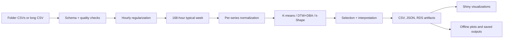

# Architecture



The offline entry point is intentionally split into a short orchestration layer:

```text
main.R
  -> scripts/main_run_preload.R
  -> scripts/main_run_input.R
  -> scripts/main_run_models.R
  -> scripts/main_review_results.R
  -> scripts/main_save_results.R
       -> reusable functions in R/
```

Each stage script exposes one principal function. Small implementation details
stay inside that function or in a clearly named reusable function under `R/`.
`main.R`, the CLI, the demo benchmark, and Shiny ultimately call the same
functions in `R/`.

The Shiny entry point follows the same orchestration pattern:

```text
app/app.R
  -> app/bootstrap/load_app.R
       -> app/config/app_config.R
       -> app/ui/help_content.R
       -> app/theory/*.R
       -> app/ui/inputs/*.R
       -> app/ui/input_workspace.R
       -> app/ui/components.R
       -> app/ui/app_ui.R
       -> app/server/app_server.R
            -> app/server/*.R
       -> reusable functions in R/
```

`app.R` is the only application file at the top level. The bootstrap loader
declares the source order explicitly; configuration, UI, teaching content and
server logic live in responsibility-specific directories. UI structure,
reactive orchestration and visual configuration can therefore be reviewed
independently.
The offline routes save versioned artifacts. Shiny can run the bundled sample or
temporary user uploads and calculates the same pipeline inside the active
session. Web limits constrain interactive DTW cost; large runs belong in
`main.R` or the CLI. Uploaded data are not copied to repository storage.

